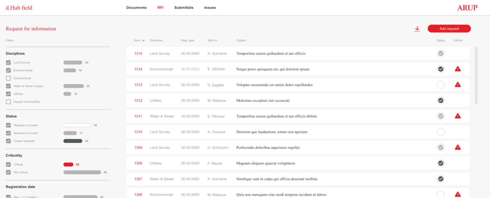

# Arup - AslanSN' Technical Test

## Instructions

The ADE team of Arup has been commissioned to design, develop, deploy and maintain an application aimed at information management in a construction site in which several companies are involved. The application has been conceived in a modular way, being one of these modules oriented to the exchange of comments or questions between different agents. The preliminary design of this module is as follows:



The view is divided into two main areas, the side panel provides information on the distribution of comments by category (by discipline, by status, etc.), and allows filtering. The second part shows a list of all questions, filtered according to the selection in the side panel, and sorted from most recent to oldest.

Clicking on any of the rows in the table would display a third panel with detailed information:


## My work

Using a `react - flux` template, with `JavaScript` and `SASS` (I know it's not very fancy) I setted up a modular web-app centered in delegations mixing object and function oriented programming. Sometimes I used the **Styled-Components** and **Bootstrap** dependencies even if not consistently, but trying to ensure a fast developing environment.

I applied `SOLID, KISS, camelCase and PascalCase` coding, documenting each function and component to ensure the comprehension of my code, being scrupulous about JavaScript **`good practices`**.


I also thought on the "on-future" development

As you can see on the structure is divided like so:

### Scheme

- js
- - index.js & *Styles.scss
- - **components**
- - - **FiltersColumn**
- - - - Filters.jsx & *Styles.scss
- - - -	FilterCards
- - - - - FilterCards.jsx & *Styles.scss
- - - - - SpecificFilter
- - - - - - SpecificFilter.jsx & *Styles.scss
- - - - StyledFilterComponents
- - - - - FilterCardsStyled.js & FilterCheckboxStyled.js & FilterLabelStyled.js
- - - **RequestDetailsColumn**
- - - - RequestDetails.jsx & *Styles.scss
- - - **RequestListColumn**
- - - - RequestList.jsx & *Styles.scss
- - - - SorterBar
- - - - - SoterBar.jsx & *Styles.scss
- - - - Item
- - - - - Item.jsx & *Styles.scss
- - - **StaticComponents**
- - - - Navbar
- - - - - Navbar.jsx & *Styles.scss
- - - - RequestBar
- - - - - RequestBar.jsx & *Styles.scss
- - - - Styled
- - - - - Button.js
- - **resources** (images and tokens)
- - **store**
- - - data (mockData.json -> The data I received)
- - - **appContext.js & flux.js**

## Conclusion
I worked a lot to achieve in less than a week the best result, and even if I'm not absolutely happy with it I am proud of my dedication and hard work with it.

### Preview
[preview](./src/js/resources/others/Captura%20de%20pantalla%202022-06-14%20154016.png)

## How to run

You can use Gitpod or so to deploy it in your web browser or clone it in your computer and if you use:
```hs
npm run start
```